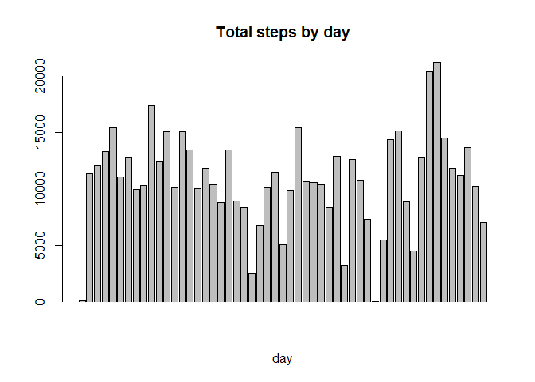
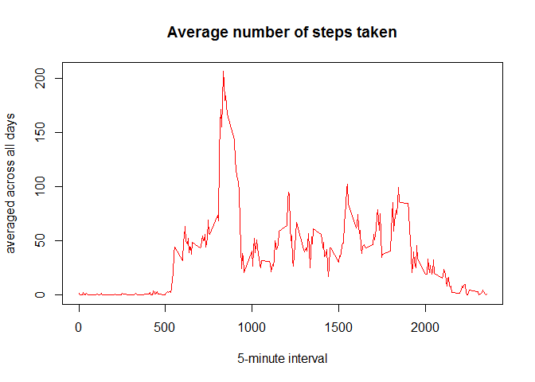
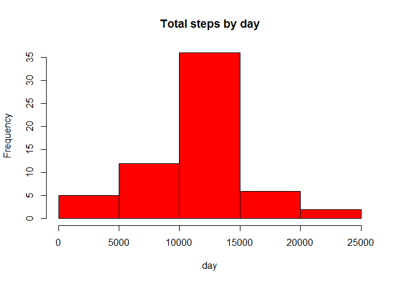

# Reproducible Research: Peer Assessment 1
Subrat Kumar  
Saturday, October 17, 2015  


## Loading and preprocessing the data
Load the data (i.e. read.csv())


```r
if(!file.exists("activity.zip")) {		
	fileurl<-'https://d396qusza40orc.cloudfront.net/repdata%2Fdata%2Factivity.zip'
	download.file(fileurl,destfile="./activity.zip")
	unzip("./activity.zip")
} else {
	unzip("./activity.zip")
}
activity<-read.csv("./activity.csv", colClasses = c("numeric", "character","numeric"))
```

Process/transform the data (if necessary) into a format suitable for your analysis


```r
names(activity)
```

```
## [1] "steps"    "date"     "interval"
```

```r
library(lattice)
activity$date <- as.Date(activity$date, "%Y-%m-%d")
```

## What is mean total number of steps taken per day?
For this part of the assignment, you can ignore the missing values in the dataset.
Calculate the total number of steps taken per day


```r
TotalStepsPerDay <- aggregate(steps ~ date, data = activity, sum, na.rm = TRUE)
```


If you do not understand the difference between a histogram and a barplot, 
research the difference between them. Make a histogram of the total 
number of steps taken each day


```r
hist(TotalStepsPerDay$steps, main = "Total steps by day", xlab = "day", col = "red")
```

 

```r
barplot(TotalStepsPerDay$steps, main="Total steps by day",xlab="day")
```

 

Calculate and report the mean and median of the total number of steps taken per day


```r
meanSteps<-mean(TotalStepsPerDay$steps)
medianSteps<-median(TotalStepsPerDay$steps)  
meanSteps
```

```
## [1] 10766.19
```

```r
medianSteps
```

```
## [1] 10765
```


## What is the average daily activity pattern?
Make a time series plot (i.e. type = "l") of the 5-minute interval (x-axis) 
and the average number of steps taken, averaged across all days (y-axis)


```r
time_series <- tapply(activity$steps, activity$interval, mean, na.rm = TRUE)
plot(row.names(time_series), time_series, type = "l", xlab = "5-minute interval", 
			 ylab = "averaged across all days", main = "Average number of steps taken", 
			 col = "red")
```

 

Which 5-minute interval, on average across all the days in the dataset, 
contains the maximum number of steps?


```r
names(which.max(time_series))
```

```
## [1] "835"
```


## Imputing missing values
Note that there are a number of days/intervals where there are missing values 
(coded as NA). The presence of missing days may introduce bias into some 
calculations or summaries of the data.

Calculate and report the total number of missing values in the dataset 
(i.e. the total number of rows with NAs)


```r
missing_val <- sum(is.na(activity))
missing_val
```

```
## [1] 2304
```

Devise a strategy for filling in all of the missing values in the dataset. 
The strategy does not need to be sophisticated. For example, you could use the 
mean/median for that day, or the mean for that 5-minute interval, etc.

Fist Na replaced by mean in 5 min interval


```r
AvgSteps <- aggregate(steps ~ interval, data = activity, FUN = mean)
#AvgSteps
fillNA <- numeric()
for (i in 1:nrow(activity)) {
		obs <- activity[i, ]
		if (is.na(obs$steps)) {
				steps <- subset(AvgSteps, interval == obs$interval)$steps
		} else {
				steps <- obs$steps
		}
		fillNA <- c(fillNA, steps)
}

#fillNA
```

Create a new dataset that is equal to the original dataset but with the missing 
data filled in.


```r
new_activity<-activity
new_activity$steps<-fillNA
```

Make a histogram of the total number of steps taken each day and Calculate and 
report the mean and median total number of steps taken per day. Do these values 
differ from the estimates from the first part of the assignment? What is the 
impact of imputing missing data on the estimates of the total daily number of 
steps?


```r
TotalStepsPerDay_new <- aggregate(steps ~ date, data = new_activity, sum, na.rm = TRUE)

hist(TotalStepsPerDay_new$steps, main = "Total steps by day", xlab = "day", col = "red")
```

 

```r
meanSteps_new<-mean(TotalStepsPerDay_new$steps)
medianSteps_new<-median(TotalStepsPerDay_new$steps)  

changeinMean<-meanSteps-meanSteps_new
changeinMean
```

```
## [1] 0
```

```r
ChangeinMedia<-medianSteps-medianSteps_new
ChangeinMedia
```

```
## [1] -1.188679
```


## Are there differences in activity patterns between weekdays and weekends?
For this part the weekdays() function may be of some help here. Use the dataset 
with the filled-in missing values for this part.

Create a new factor variable in the dataset with two levels "weekday" and 
"weekend" indicating whether a given date is a weekday or weekend day.


```r
new_activity$date <- as.Date(new_activity$date, "%Y-%m-%d")
day <- weekdays(new_activity$date)
daylevel <- vector()
for (i in 1:nrow(new_activity)) {
		if (day[i] == "Saturday") {
				daylevel[i] <- "Weekend"
		} else if (day[i] == "Sunday") {
				daylevel[i] <- "Weekend"
		} else {
				daylevel[i] <- "Weekday"
		}
}
new_activity$daylevel <- daylevel
new_activity$daylevel <- factor(new_activity$daylevel)

stepsByDay <- aggregate(steps ~ interval + daylevel, data = new_activity, mean)
names(stepsByDay) <- c("interval", "daylevel", "steps")
```

Make a panel plot containing a time series plot (i.e. type = "l") of the 5-minute
interval (x-axis) and the average number of steps taken, averaged across all 
weekday days or weekend days (y-axis). See the README file in the GitHub 
repository to see an example of what this plot should look like using simulated 
data.


```r
time_series_new <- tapply(new_activity$steps, new_activity$interval, mean, na.rm = TRUE)
library(ggplot2)
library(lattice)

xyplot(steps ~ interval | daylevel, stepsByDay, type = "l", layout = c(1, 2), 
	   xlab = "Interval", ylab = "Number of steps")
```

 

